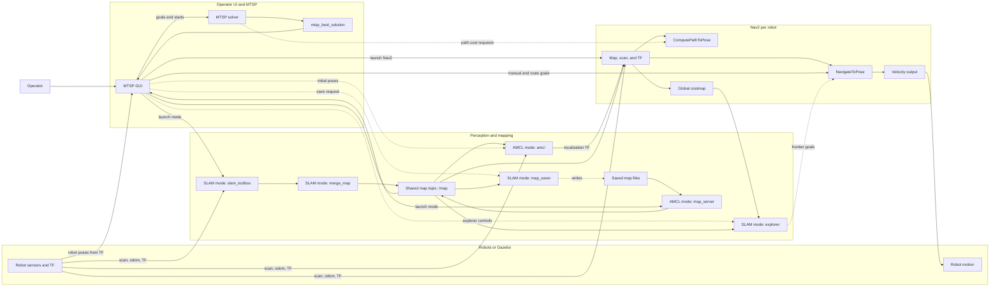
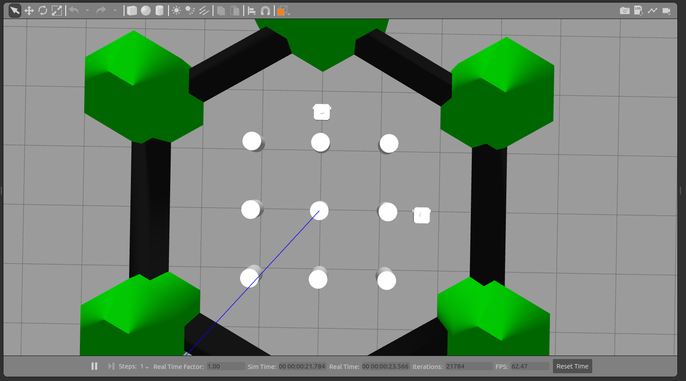
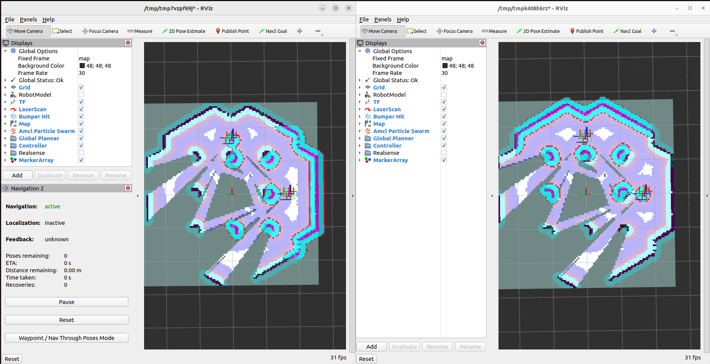
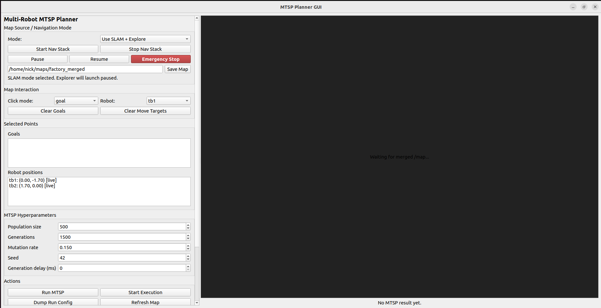
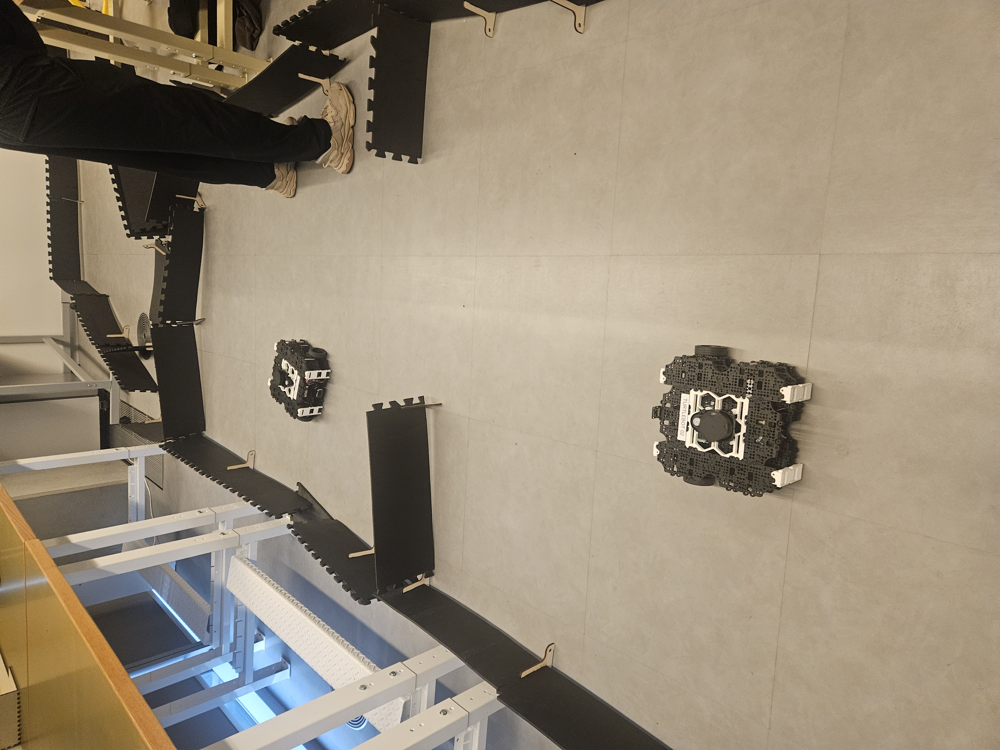

# RS2 Smart Factory Wiki

## Project overview

RS2 Smart Factory is a ROS 2 Humble multi-robot TurtleBot3 system for smart factory mapping, navigation, task planning, and GUI-driven task execution. It supports both Gazebo simulation and real TurtleBot3 robots by running each robot under a matching namespace.

## Full system flow

The current primary operator path is the MTSP GUI. It launches the navigation stack, displays the shared map, collects operator goals, runs the MTSP solver, and executes the resulting robot routes through Nav2.



### Main subsystem interactions

| Interaction | What passes between subsystems |
| --- | --- |
| Robots/Gazebo -> Perception and mapping | Namespaced scan, odometry, and TF feed SLAM Toolbox in SLAM mode or AMCL in AMCL mode. |
| Perception and mapping -> Nav2 | The shared `/map` and localization TF let Nav2 plan and execute in the `map` frame. |
| Robots/Gazebo -> Nav2 | Namespaced scan, odometry, and TF feed Nav2 costmaps and localization-dependent navigation. |
| Nav2 -> Robots/Gazebo | Nav2 outputs velocity commands for the active robot namespace. |
| MTSP GUI -> Perception and mapping | The GUI chooses SLAM or AMCL launch mode, can send AMCL initial poses, can save maps, and can start/stop/resume exploration. |
| Perception and mapping -> MTSP GUI | The GUI displays `/map` and uses TF-derived robot poses from the running mapping/localization stack. |
| MTSP GUI -> MTSP solver | The GUI sends robot starts, operator-selected goals, solver settings, and the Nav2 planner action name through a generated solver parameter file. |
| MTSP solver -> Nav2 | With the `nav2` distance backend, the solver requests planned path costs through `ComputePathToPose`. |
| MTSP solver -> MTSP GUI | The solver publishes `mtsp_best_solution`, which the GUI renders as routes and progress. |
| MTSP GUI -> Nav2 | Manual move targets and MTSP execution goals are sent through `NavigateToPose`. |
| SLAM explorer -> Nav2 | In SLAM mode, frontier exploration sends `NavigateToPose` goals and checks each robot's global costmap. |
| Map saver/server <-> Saved map files | SLAM mode writes saved map files; AMCL mode loads saved map files through the map server. |

## Key features / subsystem list

- [Perception and Mapping](Perception-and-Mapping): per-robot SLAM, merged maps, frontier exploration, saved maps, and localization against an existing factory map.
- [Interaction and Execution](Interaction-and-Execution): MTSP GUI operation, route planning, and robot execution flow.
- [Motion Planning and Control](Motion-Planning-and-Control): namespaced Nav2 bringup, robot navigation, and multi-robot route planning.

## Dependencies

### Hardware

- TurtleBot3 robots only.
- Current simulation bringup defaults to TurtleBot3 Waffle.
- On real robots, `namespaced_robot.launch.py` reads `TURTLEBOT3_MODEL` and `LDS_MODEL` from the robot environment, so set these to match the actual robot and lidar.

### Software

- ROS 2 Humble on Ubuntu 22.04. Follow the official [ROS 2 Humble Ubuntu installation guide](https://docs.ros.org/en/humble/Installation/Ubuntu-Install-Debs.html) before building this workspace.
- Gazebo Classic ROS packages for simulation. ROS 2's Gazebo setup is documented in the [ROS 2 Humble Gazebo tutorial](https://docs.ros.org/en/humble/Tutorials/Advanced/Simulators/Gazebo/Gazebo.html); this project uses the ROS/Gazebo packages installed through apt below.
- Navigation2 and Nav2 messages.
- TurtleBot3 bringup, description, navigation, Gazebo, and simulation packages.
- SLAM Toolbox.
- `robot_state_publisher`, `tf2_ros`, `xacro`, and `hls_lfcd_lds_driver`.
- Python GUI/runtime libraries: PyQt5, NumPy, and PyYAML.
- Project packages in this repository:
  - `smart_factory_bringup`
  - `smart_factory_navigation`
  - `smart_factory_task_server`
  - `smart_factory_ui`
  - `smart_factory_mtsp_solver`
  - `smart_factory_fleet_msgs`
  - `merge_map`

Install common system dependencies:

```bash
sudo apt update
sudo apt install -y ros-humble-navigation2 ros-humble-nav2-bringup ros-humble-nav2-msgs ros-humble-slam-toolbox ros-humble-gazebo-ros-pkgs ros-humble-turtlebot3 ros-humble-turtlebot3-bringup ros-humble-turtlebot3-description ros-humble-turtlebot3-gazebo ros-humble-turtlebot3-navigation2 ros-humble-turtlebot3-simulations ros-humble-robot-state-publisher ros-humble-tf2-ros ros-humble-xacro ros-humble-hls-lfcd-lds-driver python3-pyqt5 python3-numpy python3-yaml
```

Use `rosdep` from the workspace to install package dependencies declared in `package.xml` files:

```bash
source /opt/ros/humble/setup.bash
rosdep update
rosdep install --from-paths src --ignore-src -r -y
```

## Installation

### Hardware

- Install and secure the custom end-effector on each TurtleBot3.
- Confirm the end-effector does not block the lidar, wheels, emergency access, or charging access.
- Update the URDF and Nav2 footprint/inflation settings if the end-effector changes the robot footprint.
- Prepare the work area so robot start positions match `src/smart_factory_bringup/params/general_settings.yaml`. One robot should be treated as the origin at `x_pose: 0.0`, `y_pose: 0.0`; other robots should use their relative x/y distance from that robot in meters.
- Keep all robots and the operator workstation on the same ROS 2 network.

### Software

Clone and build the project workspace:

```bash
cd ~
git clone https://github.com/rocket770/RS2_smart_factory.git smart_factory_ws
cd ~/smart_factory_ws
git checkout main
source /opt/ros/humble/setup.bash
rosdep update
rosdep install --from-paths src --ignore-src -r -y
colcon build --symlink-install
source install/setup.bash
```

The recommended branch for simulation is `main`. For real robots, `real-robot-test-nick` is optimized for physical TurtleBot3 runs:

```bash
git checkout real-robot-test-nick
```

Install the namespaced robot launch file and URDF assets on each real TurtleBot3:

```bash
ssh ubuntu@<robot-ip>
source /opt/ros/humble/setup.bash
mkdir -p ~/rs2_ws/src
cd ~/rs2_ws/src
ros2 pkg create multi_robot_bringup --build-type ament_cmake
mkdir -p multi_robot_bringup/launch multi_robot_bringup/urdf
```

Replace `~/rs2_ws/src/multi_robot_bringup/CMakeLists.txt` on the robot with:

```cmake
cmake_minimum_required(VERSION 3.5)
project(multi_robot_bringup)

find_package(ament_cmake REQUIRED)

install(DIRECTORY
  launch
  urdf
  DESTINATION share/${PROJECT_NAME}
)

ament_package()
```

From the operator workstation, copy the launch file and URDF assets to the robot:

```bash
cd ~/smart_factory_ws
scp src/smart_factory_bringup/launch/namespaced_robot.launch.py ubuntu@<robot-ip>:~/rs2_ws/src/multi_robot_bringup/launch/
scp -r src/smart_factory_bringup/urdf/* ubuntu@<robot-ip>:~/rs2_ws/src/multi_robot_bringup/urdf/
```

Then build on the robot:

```bash
ssh ubuntu@<robot-ip>
cd ~/rs2_ws
source /opt/ros/humble/setup.bash
colcon build --symlink-install
source install/setup.bash
```

Note: `namespaced_robot.launch.py` currently loads the default TurtleBot3 URDF from `turtlebot3_description`. If the custom end-effector requires a custom URDF, update the launch file to load the copied URDF from `multi_robot_bringup/urdf` or install the custom URDF into the robot description package.

## Running the system

### Configure robot namespaces

Robot names and starting poses are defined in:

```text
src/smart_factory_bringup/params/general_settings.yaml
```

This file should contain one entry for every robot in the system. The same robot names must be used when launching the physical robots with `namespace:=...`.

Example:

```yaml
robots:
  - name: tb1
    x_pose: 0.0
    y_pose: 0.0
    z_pose: 0.01
  - name: tb2
    x_pose: 2.5
    y_pose: 0.5
    z_pose: 0.01
```

Robot `tb1` is the reference robot at `(0.0, 0.0)`. Robot `tb2` starts 2.5 meters in the positive x direction and 0.5 meters in the positive y direction from `tb1`. Add more robots by adding more entries and launching each robot with the same namespace and matching starting pose.

### Start simulation if needed

For simulation runs, start Gazebo first:

```bash
cd ~/smart_factory_ws
source /opt/ros/humble/setup.bash
source install/setup.bash
ros2 launch smart_factory_bringup multi_robot_gazebo_bringup.launch.py use_sim_time:=true
```

For real-robot runs, skip this step and launch the physical robots instead.

### Main launch

```bash
cd ~/smart_factory_ws
source /opt/ros/humble/setup.bash
source install/setup.bash
ros2 run smart_factory_ui mtsp_planner_gui
```

The GUI is the main entry point for both simulation and real hardware. It launches the rest of the system, so the normal operator flow is to start the GUI and then use the GUI controls instead of manually launching each subsystem.

Set simulation time according to the run mode:

- Simulation: use simulation time.
- Real robots: do not use simulation time.

### Launch real robots

Before starting the GUI for a real-robot run, launch the base TurtleBot3 stack on each physical robot under its assigned namespace. The launch arguments must match `general_settings.yaml`.

Robot `tb1`:

```bash
ssh ubuntu@<tb1-ip>
source /opt/ros/humble/setup.bash
source ~/rs2_ws/install/setup.bash
export TURTLEBOT3_MODEL=waffle
export LDS_MODEL=LDS-01
ros2 launch multi_robot_bringup namespaced_robot.launch.py namespace:=tb1 x_pose:=0.0 y_pose:=0.0
```

Robot `tb2`, 2.5 meters in the positive x direction and 0.5 meters in the positive y direction from `tb1`:

```bash
ssh ubuntu@<tb2-ip>
source /opt/ros/humble/setup.bash
source ~/rs2_ws/install/setup.bash
export TURTLEBOT3_MODEL=waffle
export LDS_MODEL=LDS-01
ros2 launch multi_robot_bringup namespaced_robot.launch.py namespace:=tb2 x_pose:=2.5 y_pose:=0.5
```

Additional robots follow the same pattern:

```bash
ros2 launch multi_robot_bringup namespaced_robot.launch.py namespace:=<robot-name> x_pose:=<relative-x-meters> y_pose:=<relative-y-meters>
```

There is no fixed robot count in the wiki workflow. The practical limit depends on available robots, compute, network reliability, and whether every robot has a matching entry in `general_settings.yaml`.

### Expected outcome

- Gazebo opens with one robot per entry in `general_settings.yaml`.
- The GUI opens and launches the configured system.
- RViz opens when enabled from the launch flow.
- Namespaced robot topics appear under names such as `/tb1/scan`, `/tb1/odom`, `/tb2/scan`, and `/tb2/odom`.
- In SLAM mode, the system publishes a merged `/map`.
- In existing-map mode, Nav2 localizes each robot against the provided map.
- The GUI can be used to create tasks and send routes.

Short startup warnings from RViz, Nav2, or DDS can appear while nodes discover each other and lifecycle nodes activate. These can usually be ignored if the warnings stop, `/map` is being received, TF is connected, and Nav2 action servers become available.

Recent SLAM-mode real-robot tuning keeps merged `/map` reliable for Nav2 Humble compatibility, throttles `merge_map` output with `publish_period_sec`, slows SLAM map updates to reduce network load, and makes the explorer check each goal against the target robot's current global costmap before sending it to Nav2.

Screenshots:

Gazebo simulation (`gazebo_sim.png`):



RViz multi-robot navigation (`rviz_multi_robot.png`):



GUI (`GUI.png`):



Real TurtleBot3 hardware setup (`real_robot_setup.jpg`):



## Subsystem specifics

- [Perception and Mapping](Perception-and-Mapping)
- [Interaction and Execution](Interaction-and-Execution)
- [Motion Planning and Control](Motion-Planning-and-Control)

## Troubleshooting & FAQs

### Lidar is not spinning on a real robot

- Unplug and replug the lidar USB cable.
- Confirm the lidar port matches the launch argument, usually `port:=/dev/ttyUSB0`.
- Confirm `LDS_MODEL` is set correctly before launch.
- Restart the namespaced robot launch after reconnecting the lidar.

### Topics or nodes are missing between robots and the operator workstation

- Set the same `ROS_DOMAIN_ID` on every robot and on the operator workstation.
- Confirm all machines are on the same network.
- Make sure the firewall allows ROS 2/DDS traffic.
- Re-source the ROS 2 and workspace setup files in every terminal.
- Check that each robot was launched with a namespace matching `general_settings.yaml`.

### Mapping freezes or robot poses become stale after connecting a TurtleBot

- Check whether the TurtleBot has a different date/time from the operator workstation.
- If the clocks differ, ROS timestamps will not line up. Mapping may look frozen, TF/extrapolation warnings may appear, robot poses may become stale, and that robot's data may stop contributing cleanly to `/map`.
- Run `date -u` or `python3 tools/perception_mapping/check_time_sync.py` on the TurtleBot and workstation, then compare the UTC time.
- Synchronize the clocks with NTP or manual time sync, then relaunch the robot bringup and mapping stack.

### Robot appears in the wrong place

- Check the `x_pose` and `y_pose` launch arguments used on the robot.
- Confirm the same pose values are reflected in `general_settings.yaml`.
- Use one robot as the `(0.0, 0.0)` reference and enter every other robot pose as a relative offset in meters.

### GUI opens but the system does not behave like the selected run mode

- Simulation should use simulation time.
- Real robots should not use simulation time.
- Restart the GUI after changing run mode settings.
