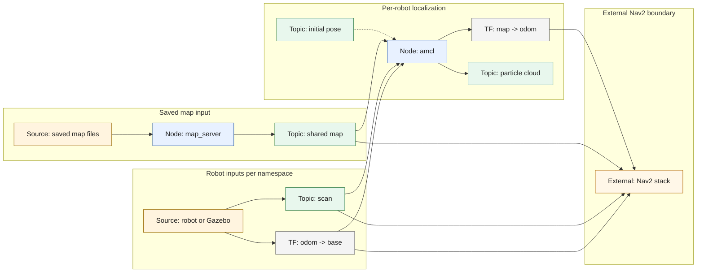

# Perception and Mapping Detailed Flow

This is the lower-level companion to [Perception and Mapping](Perception-and-Mapping). It shows the important node, topic, service, and action handoffs that make the mapping subsystem work. Nav2 is still shown as a boundary because its internal planners, controllers, behavior tree, and lifecycle details are outside this subsystem.

The active robot namespaces come from `smart_factory_bringup/params/general_settings.yaml`. In this workspace they are `tb1` and `tb2`. In the diagrams, `<robot_ns>/...` means the same interface exists once per active robot namespace, for example `tb1/map` and `tb2/map`.

Diagram labels are shortened to keep the rendered boxes readable. The full node, topic, service, and action names are listed in the interface summary.

## SLAM Mode

```mermaid
flowchart LR
    classDef source fill:#fff4df,stroke:#9a6a00,color:#1f1f1f
    classDef node fill:#e8f1ff,stroke:#2b5c9e,color:#1f1f1f
    classDef topic fill:#e8f7ed,stroke:#2f7d46,color:#1f1f1f
    classDef service fill:#f3e8ff,stroke:#6b3fa0,color:#1f1f1f
    classDef action fill:#ffe8ef,stroke:#a33d5e,color:#1f1f1f
    classDef external fill:#fff7e8,stroke:#b36b00,color:#1f1f1f
    classDef tf fill:#f4f4f4,stroke:#666,color:#1f1f1f

    subgraph RobotInputs["Robot inputs per namespace"]
        direction TB
        RobotSource["Source: robot or Gazebo"]
        ScanTopic["Topic: scan"]
        OdomTf["TF: odom -> base"]
        MapAnchor["TF: map -> local map"]
        RobotSource --> ScanTopic
        RobotSource --> OdomTf
    end

    subgraph PerRobotSlam["Per-robot SLAM"]
        direction TB
        SlamNode["Node: slam_toolbox"]
        RobotMapTopic["Topic: robot map"]
        SlamSideTopics["Topics: map metadata/updates"]
        SlamNode --> RobotMapTopic
        SlamNode -.-> SlamSideTopics
    end

    subgraph SharedMapping["Shared map build and save"]
        direction TB
        MergeNode["Node: merge_map"]
        SharedMapTopic["Topic: shared map"]
        MapSaverNode["Node: map_saver"]
        SaveMapService["Service: save_map"]
        MergeNode --> SharedMapTopic
        SharedMapTopic --> MapSaverNode
        SaveMapService -.-> MapSaverNode
    end

    subgraph ExplorationNav2["Exploration and external Nav2 boundary"]
        direction TB
        ExplorerNode["Node: explorer"]
        ExplorerServices["Services: explorer control"]
        MarkerTopic["Topic: markers"]
        NavAction["Action: navigate_to_pose"]
        Nav2Boundary["External: Nav2 stack"]
        CostmapTopic["Topic: global costmap"]
        ExplorerServices -.-> ExplorerNode
        ExplorerNode --> MarkerTopic
        ExplorerNode -- "goal" --> NavAction
        NavAction --> Nav2Boundary
        Nav2Boundary --> CostmapTopic
        CostmapTopic --> ExplorerNode
    end

    ScanTopic --> SlamNode
    OdomTf --> SlamNode
    RobotMapTopic --> MergeNode
    MapAnchor -.-> MergeNode

    SharedMapTopic --> ExplorerNode
    SharedMapTopic --> Nav2Boundary
    ScanTopic --> Nav2Boundary
    OdomTf --> Nav2Boundary

    class RobotSource source
    class SlamNode,MergeNode,MapSaverNode,ExplorerNode node
    class ScanTopic,RobotMapTopic,SlamSideTopics,SharedMapTopic,MarkerTopic,CostmapTopic topic
    class SaveMapService,ExplorerServices service
    class NavAction action
    class Nav2Boundary external
    class OdomTf,MapAnchor tf
```

In SLAM mode, the important path is:

`<robot_ns>/scan` and robot TF -> `<robot_ns>/slam_toolbox` -> `<robot_ns>/map` -> `/merge_map` -> `/map`

`/multi_robot_explorer` then reads `/map`, checks each robot's Nav2 global costmap, and sends frontier goals to `<robot_ns>/navigate_to_pose`. `/map_saver` saves the merged `/map` when `/map_saver/save_map` is called.

## AMCL Mode

In AMCL mode, the important path is:

Saved map YAML and image -> `/map_server` -> `/map` -> `<robot_ns>/amcl`

Each AMCL node uses the shared `/map`, namespaced scan data, and robot TF to publish the robot's localization transform. AMCL mode does not run SLAM Toolbox, map merging, map saving, or frontier exploration.

## Interface Summary

| Node | Mode | Important inputs | Important outputs |
| --- | --- | --- | --- |
| `<robot_ns>/slam_toolbox` | SLAM | `<robot_ns>/scan`; robot odom/base TF | `<robot_ns>/map`; `<robot_ns>/map_metadata`; `<robot_ns>/map_updates` |
| `/merge_map` | SLAM | `<robot_ns>/map` topics matching `^/tb\d+/map$`; map-frame TF anchors | `/map` |
| `/map_saver` | SLAM | `/map`; `/map_saver/save_map` service request | Saved map YAML and image |
| `/multi_robot_explorer` | SLAM | `/map`; shared and namespaced TF; `<robot_ns>/global_costmap/costmap`; explorer control services | `<robot_ns>/navigate_to_pose` action goals; `/multi_robot_explorer/markers` |
| `/map_server` | AMCL | Saved map YAML and image | `/map` |
| `<robot_ns>/amcl` | AMCL | `/map`; `<robot_ns>/scan`; robot odom/base TF; optional `<robot_ns>/initialpose` | Localization TF; `<robot_ns>/particle_cloud` |
| `<robot_ns>` Nav2 stack | Both | `/map`; `<robot_ns>/scan`; robot TF; explorer goals in SLAM mode | `<robot_ns>/global_costmap/costmap`; `<robot_ns>/navigate_to_pose` action server |

Lifecycle managers and RViz are intentionally left out of the diagrams. They are important for startup and visualization, but they are not part of the map data path.
